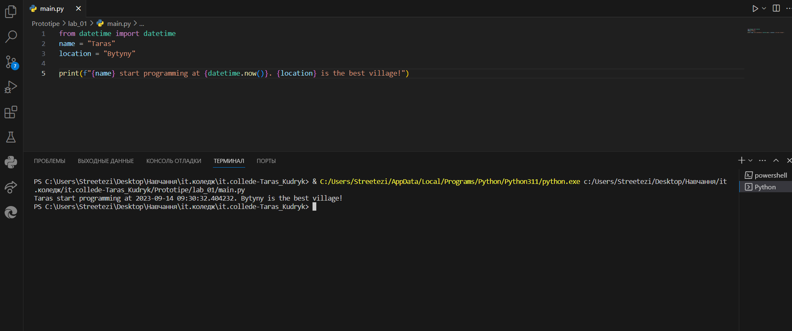

# Звіт до роботи
## Тема: _згідно теми_
### Мета роботи: _згідно теми_
---
### Виконання роботи
- Результати виконання завдання ;
    1. Розробили/Створили **програму яка вираховує теперішній час та дату.**

    1. Програма вивела значення **Taras start programming at 2023-09-17 11:01:07.860959. Bytyny is the best village!**

    1. Отримано наступні результати **2023-09-17 11:01:07.860959**
    
    1. Навчились **Навчилися писати програму яка звертається до свого власника та показує його місце проживання та теперішню дату та час**
    
> якщо графічних файлів багато то краще помістити їх у окрему папку, наприклад у мене це папка `pictures`. Уважно дивіться коли вставляєте URL - файл має бути представленим як `raw`. 


- вставлений код / текстовий або числовий результат / інші результати:
```python
from datetime import datetime
name = "Taras"
location = "Bytyny"

print(f"{name} start programming at {datetime.now()}. {location} is the best village!")
```
```text
<< Taras start programming at 2023-09-17 11:03:51.695290. Bytyny is the best village! >>
```

- результати виконання індивідуального завдання (якщо такі є);

### Висновок: 
> у висновку потрібно відповісти на запитання:
- :question: Що зроблено в роботі;

:white_check_mark: Написано код на такій мові як **Python**, та сконструйовано програму яка вираховує дату та час;

- :question: Чи досягнуто мети роботи;

:white_check_mark: Так, мета роботи була успішно досягнута;

- :question: Які нові знання отримано;

:white_check_mark: На даний момент створення цієї роботи я навчився працювати з репозиторіями та малими кроками розвивати свої програмні здібності;

- :question: Чи вдалось відповісти на всі питання задані в ході роботи;

:white_check_mark: Так, вдалося;

- :question: Чи вдалося виконати всі завдання;

:white_check_mark: Так, вдалося;

- :question: Чи виникли складності у виконанні завдання;

:white_check_mark: Ні, складностей не виникало;

- :question: Чи подобається такий формат здачі роботи (Feedback);

:white_check_mark: Так, подобається;

- :question: Побажання для покращення (Suggestions);

:white_check_mark: Побажань поки що немає так як поки все подобається;

---